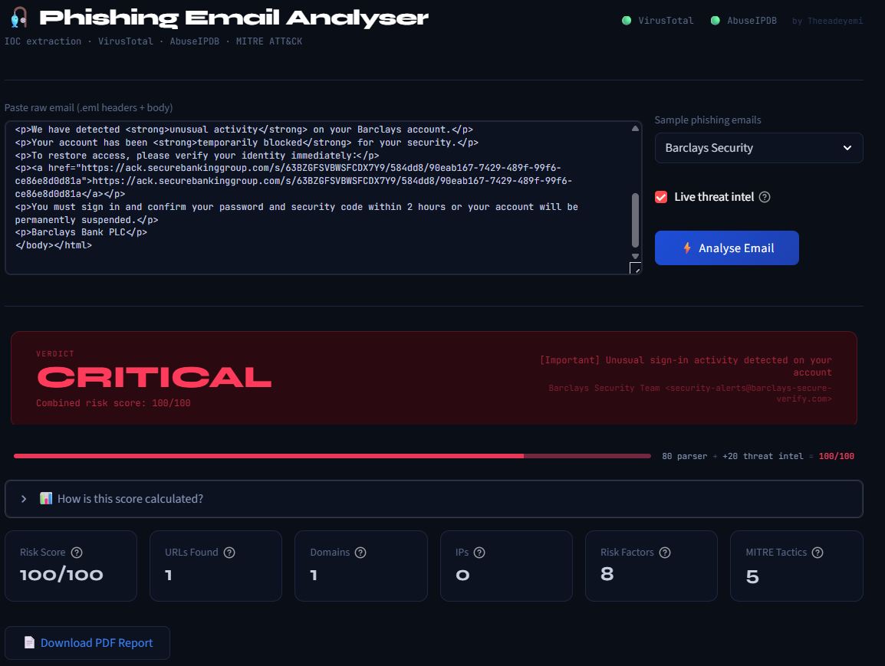
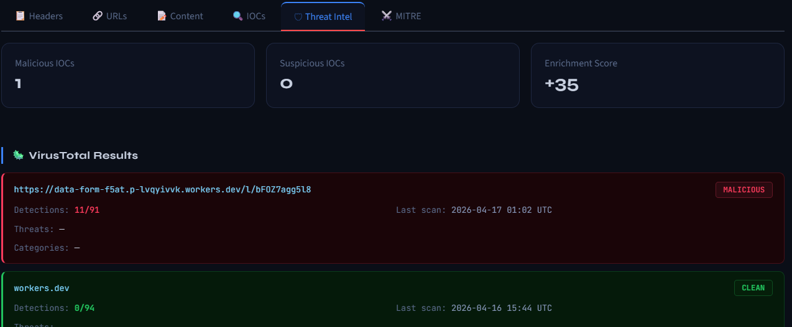
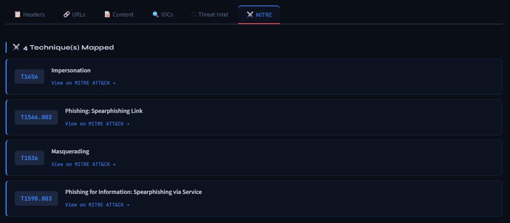
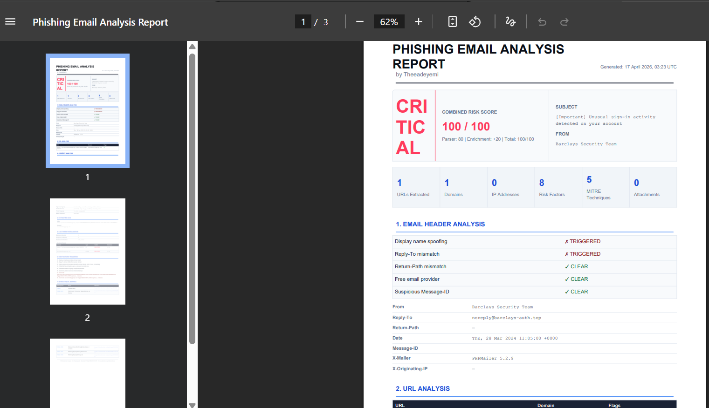

# 🎣 Phishing Email Analyser

A Python-based threat intelligence tool that parses raw phishing emails, extracts indicators of compromise (IOCs), enriches them with live API data, and generates a downloadable PDF report — all through a clean web dashboard.

Built by **Theeadeyemi** as a practical cybersecurity project to demonstrate real-world skills in threat analysis, IOC extraction, and API integration.

---

## Features

- **Email parser** — extracts IOCs from raw `.eml` files: URLs, domains, IPs, email addresses, attachments
- **Header anomaly detection** — display name spoofing, Reply-To mismatches, free email providers, suspicious Message-IDs
- **Social engineering detection** — urgency language, credential lures, threat phrases, brand impersonation
- **VirusTotal integration** — live URL, domain, and IP reputation lookups
- **AbuseIPDB integration** — IP abuse score, country, ISP, Tor exit node detection
- **MITRE ATT&CK mapping** — each finding mapped to a framework technique with direct links
- **Risk scoring engine** — 0–100 combined score (parser + threat intel), labelled LOW / MEDIUM / HIGH / CRITICAL
- **PDF report export** — professional downloadable report after every analysis
- **4 built-in UK phishing samples** — HMRC, Royal Mail, Barclays, Microsoft 365

---

## Screenshots

> Dashboard after analysing a Barclays bank phishing email






---

## Quick Start

### 1. Clone the repo

```bash
git clone https://github.com/YOUR_USERNAME/phishing-analyser.git
cd phishing-analyser
```

### 2. Install dependencies

```bash
pip install -r requirements.txt
```

### 3. Add API keys

Open `config.py` and paste your free API keys:

```python
VIRUSTOTAL_API_KEY  = "your_key_here"   # virustotal.com — free account
ABUSEIPDB_API_KEY   = "your_key_here"   # abuseipdb.com  — free account
```

### 4. Run the dashboard

```bash
streamlit run app.py
```

Opens at `http://localhost:8501`

---

## File Structure

```
phishing-analyser/
├── app.py              # Streamlit dashboard (main UI)
├── email_parser.py     # IOC extraction engine
├── threat_intel.py     # VirusTotal + AbuseIPDB API integration
├── pdf_report.py       # PDF report generator
├── sample_emails.py    # 4 UK phishing test cases
├── config.py           # API key configuration
├── requirements.txt    # Dependencies
├── test_parser.py      # Terminal test — parser only
└── test_enrichment.py  # Terminal test — full pipeline
```

---

## How It Works

```
Raw email (.eml)
       │
       ▼
 Email Parser          ← extracts headers, URLs, body, attachments
       │
       ▼
 IOC Extractor         ← identifies domains, IPs, email addresses
       │
       ▼
 Risk Scorer           ← 30+ rules, MITRE ATT&CK mapping
       │
       ▼
 Threat Intel APIs     ← VirusTotal + AbuseIPDB live lookups
       │
       ▼
 Streamlit Dashboard   ← 6-tab UI with PDF export
```

---

## Dependencies

```
streamlit
requests
tldextract
reportlab
```

Install all at once:

```bash
pip install -r requirements.txt
```

---

## API Keys (Free Tiers)

| API | Free Tier | Sign Up |
|-----|-----------|---------|
| VirusTotal | 500 requests/day, 4/min | [virustotal.com](https://www.virustotal.com/gui/join-us) |
| AbuseIPDB  | 1,000 requests/day | [abuseipdb.com](https://www.abuseipdb.com/register) |

The tool works without API keys — it runs the parser and scoring engine, but skips live lookups.

---

## Sample Phishing Emails

The repo includes 4 synthetic UK-targeted phishing emails for testing:

| Sample | Tactics Used |
|--------|-------------|
| HMRC Tax Refund | IP-based URL, credential harvest form, Reply-To mismatch |
| Royal Mail Parcel | URL shorteners, macro-enabled attachment, href/text mismatch |
| Barclays Security | Typosquatting domain, urgency + threat language combo |
| Microsoft 365 | Double typosquat, HTML password harvest form |

---

## Disclaimer

This tool is built for **educational and professional security research purposes**. All sample phishing emails are synthetic and fabricated for testing. Never use this tool against emails or infrastructure you do not own or have permission to analyse.

---

## Author

Built by **Theeadeyemi**

- IOC extraction · Threat intelligence · MITRE ATT&CK
- Python · Streamlit · VirusTotal API · AbuseIPDB API
